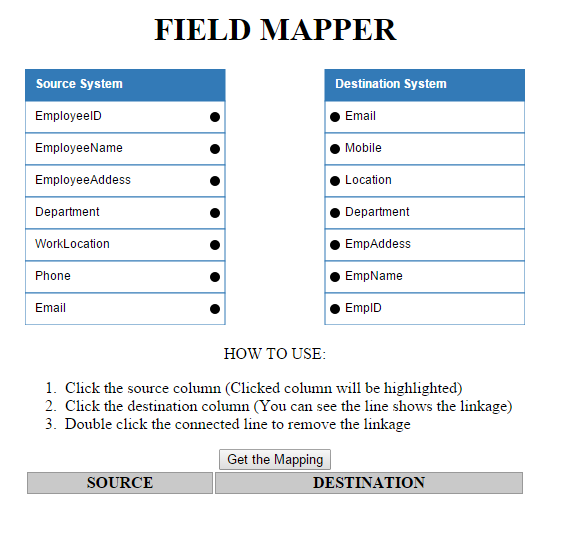
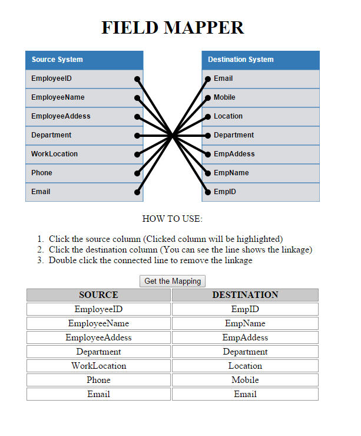

# Field Mapper
It's AngularJS's directive for field mapping. It can be used for any two list mapping or database table's column mapping.

## Requirements

- AngularJS 1.3.X  (https://angularjs.org/)
- D3 3.5.x (http://d3js.org/)

## How to Use

- `Refer demo/index.html source`

## Sample Screen-shots

#### Initial Screen

#### Fields Connected

MIT License
